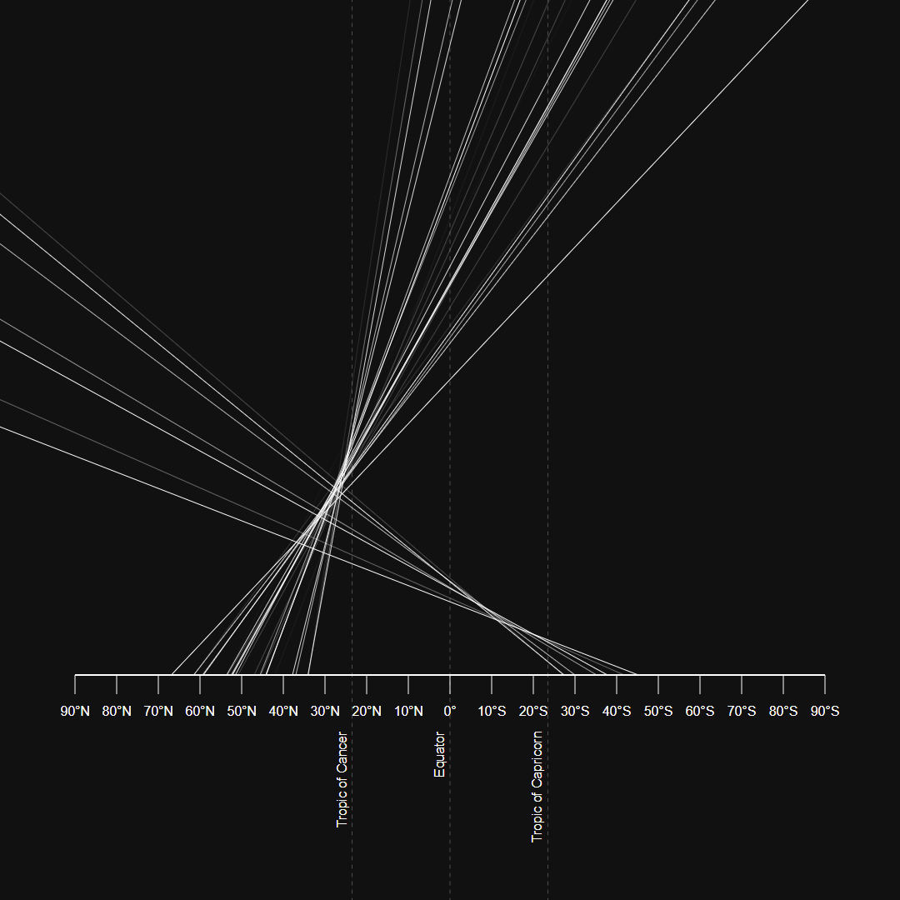

# Solstice Observations 2021

_I Can Science That_ organized an effort to observe the sun angles at multiple latitudes at solar noon on 2021-06-20. [This is an interactive visualization of the resulting data](http://solstice2021.heh.fi/).

[Solstice Observations Raw Results](https://youtu.be/KXjz16wRUq0) by _I Can Science That_

Drag the diagram to change the hypothesis between a hollow Earth, a flat Earth and a globe Earth.

For each angle measurement, an error is estimated by calculating the difference to a linear least squares fit of all the measurements. The measurements with a high error are shown with a less visible color.

